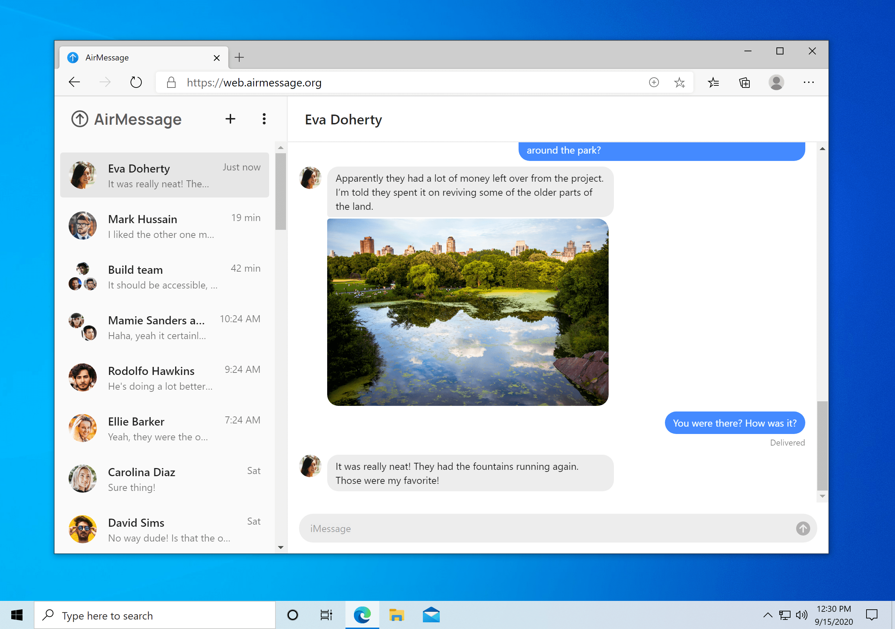
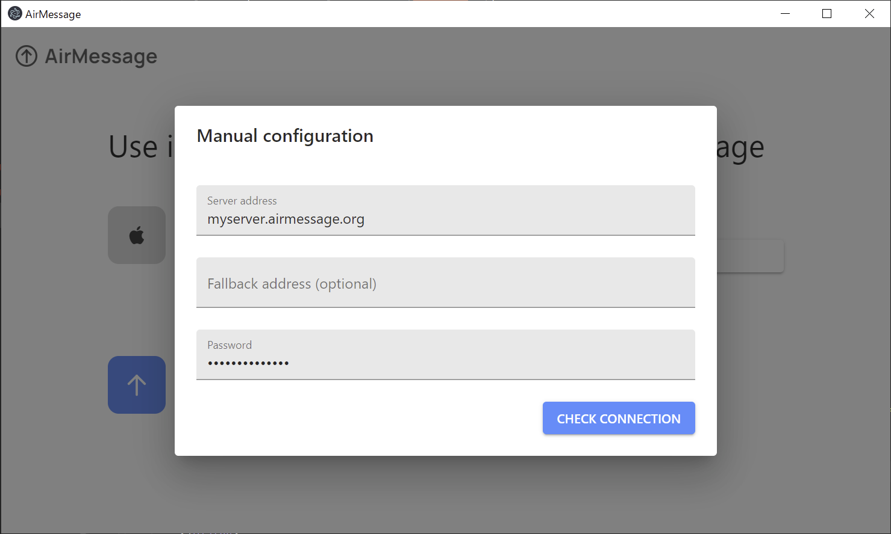

# AirMessage for web

AirMessage lets people use iMessage on the devices they like.
**AirMessage for web** brings iMessage to modern web browsers over a WebSocket proxy.
Production builds are hosted on [web.airmessage.org](https://web.airmessage.org).

## Getting started

AirMessage for web uses [React](https://reactjs.org), [Electron](https://electronjs.org), and [TypeScript](https://www.typescriptlang.org). If you're not familiar with these tools, they all have great introductory guides:
- [React - Getting started](https://reactjs.org/docs/getting-started.html)
- [Electron - Quick start](https://www.electronjs.org/docs/tutorial/quick-start)
- [TypeScript for JavaScript Programmers](https://www.typescriptlang.org/docs/handbook/typescript-in-5-minutes.html)

AirMessage for web uses a configuration file to associate with online services like Firebase and Sentry.
`/src/secure/config-blank.ts` contains empty definitions for values that are used in the config.
Copy it to `/src/secure/config.ts` to enable the app to build.
If you're building for Electron, you can leave the config values blank.

## File structure outline

- `/public` holds static files that are copied in at build time. It also holds the app's entry point, `index.html`.
- `/src` holds shared source files - where most of the UI logic resides.
- `/browser` holds all browser-specific code. This includes logic for authenticating with Firebase and using AirMessage's WebSocket proxy.
- `/electron-main` holds the code that runs on Electron's main process.
- `/electron-renderer` holds all code that runs on Electron's renderer process. This includes UI and logic for establishing direct TCP connections. 
- Builds are located in `/build` for web builds, and `/dist` for Electron builds.

`/browser` and `/electron-renderer` are aliased to the import prefix `/platform-components` at build time, depending on the build target.
As such, components that are imported from `/src` must be available in both directories. If you're adding or modifying any files in these build-specific directories, please ensure that they are imported properly with the `/platform-components` alias.

Any extra files under build-specific directories (`/browser` or `/electron-renderer`) that aren't used by `/src` should be under a `private` subdirectory.

## Developing and running Electron builds

AirMessage has recently acquired support for running in Electron environments, enabling direct connections back to servers.
However, this is still in development and still lacks some features that would be needed for day-to-day use.

We ask that you do not user AirMessage's proxy servers in your own apps without consent from AirMessage.
As such, the best way to run AirMessage locally is using its Electron builds.

Builds for web browsers and Electron will be kept in sync, so any changes made to files under the `/src` directory will make their way into the web app as well.

To launch Electron in a development environment with fast refresh, run `npm run electron-start`.
To build Electron for your platform, run `npm run electron-distribute`.

---

Thank you for your interest in contributing to AirMessage!
You're helping to shape the future of an open, secure messaging market.
Should you have any questions, comments, or concerns, please shoot an email to [hello@airmessage.org](mailto:hello@airmessage.org).